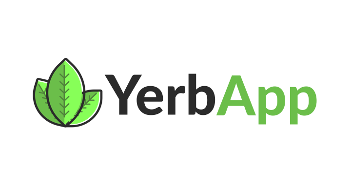

## Find your Yerba Mate

**YerbApp** is the simple web application that allows you to browse Yerba Mate products, its main feature is personalized search, our backend services are matching products basing on Your preferences, e.g taste, price, aroma and its importances.

*Imagine being regular Yerba Mate enthusiast that really likes smoky flavour of Yerba Mate, price doesn't matter, earthy aroma neither, the only thing you want is the smoky flavour coming from your matero through your fancy bombilla, **YerbApp** will try to help you solve your problems*

---

### Functionalities

* Roles based authorization
* Setting users preferences
* Admin panel for Yerba Mate types and manufacturers
* Reviews
* Products, preferences based sorting
  
### Technologies

* `Typescript`
* `React`
* `styled-components`
* `GraphQL`
* `Apollo Client`
* `Redux Saga`
* `Redux`
* `redux-starter-kit`
* `Antd`
* `Formik`

---

### Todo functionalities

* Bug fixes
* GraphQL cache management
* Gamification - usage of experience points that are being added by performing actions like posting review etc
* Create better error handling
* English/Spanish language
* More meaningfull data for users like example shop link etc.
